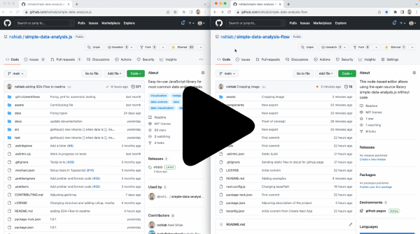
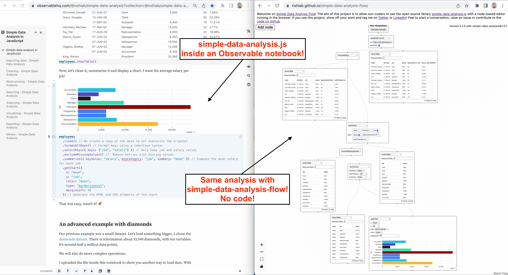

# SDA-Flow (Under heavy development)

You can use SDA-Flow here: https://nshiab.github.io/simple-data-analysis-flow/

This repository is maintained by [Nael Shiab](http://naelshiab.com/), senior data producer at [CBC/Radio-Canada](https://cbc.radio-canada.ca/).

If you use the library, show off your work and tag me on [Twitter](https://twitter.com/NaelShiab) or [LinkedIn](https://www.linkedin.com/in/naelshiab/)! :)

These project's goal are:

- To allow non-coders to use the open source library [simple-data-analysis.js](https://github.com/nshiab/simple-data-analysis).

- To create a node-based editor for data analysis running in the browser.

## Example

Check the demo by clicking on the image below. It redirects to YouTube.

Here's the final result of the demo. It's an example from the [simple-data-analysis.js library inside an Observable notebook](https://observablehq.com/@nshiab/simple-data-analysis?collection=@nshiab/simple-data-analysis-in-javascript), with the equivalent made with SDA-Flow.

## Core principles

The editor is built as a [NextJS app](https://nextjs.org/), with [simple-data-analysis.js](https://github.com/nshiab/simple-data-analysis) and [React Flow](https://github.com/wbkd/react-flow).

All of the computations are ran in the browser.

Feel free to start a conversation or create a new issue. If you want to contribute to the code, let's talk! :)